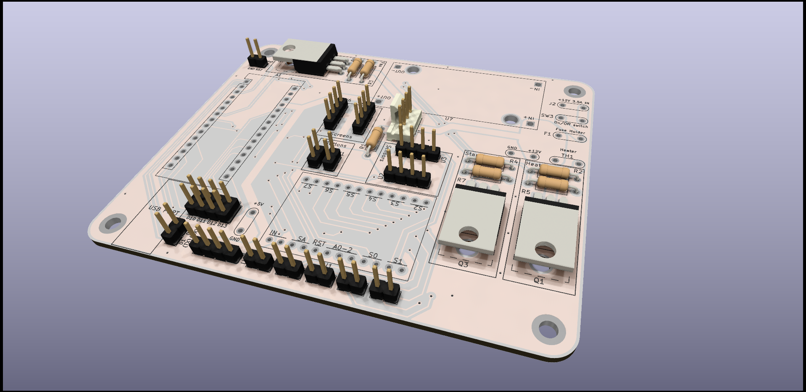

# FilamentDryer KiCad

This is my first ever PCB design, nothing too interesting.

As this is my first electronic project with a custom PCB, this whole thing is a mess and I wouldn't do anything like this ever again ^^'

A lot of lessons were learned. I ordered and tested the board and everything is working as expected, but because I was ignorant there is a chance the whole PCB is a ticking bomb especially considering I totally forgot everything about it. Younger me might have miscalculated (or simply not calculated at all) some power usage somewhere, and it is possible a resistor, trace, component or whatever burst in flames and magic smokes.

## The Board

There aren't really that many components on this board, except a few resistors and MOSFETs. It mostly is a scaffolding for other PCBs : 
* Arduino Nano
* TCA9548A I²C multiplexer
* LM2596 buck converter to lower the voltage to 5V for the Arduino

The board has other peripherals :
* The DC 12V 5W 80°C PTC heating element
* AT24C256, an I²C EEPROM to store the temperature and humidity graphs.
* DHT22 sensor to control the heating element
* Two I²C OLED screens
* PC fan
* Loadcell and the HX711 (it's amplifier) to measure how many filament is left
* A few buttons to control everything

## Why I did all this

My 3D printer had a moisture problem (Apparently PETG doesn't like humidity that much). The solution to this problem was to put the filament in the oven for a few hours, but I am not dumb enough to put a plastic that can have any number of toxic additives in the same oven I used to bake the food I eat.

Some companies sell filament dryers, the lowest of which was 60€ at the time. After looking around on the Internet I found a [series of videos](https://www.youtube.com/watch?v=IPKQCZ75Vwg&list=PLU5lZZLWyxXBlUrfcWFHtYylawElMm2N6) from [My Tech Fun](https://www.youtube.com/@MyTechFun) comparing several dryers, the ones at the lowest prices were surprisingly ineffective and required a lot of DIY to make them more efficient. While the most expansive were absolutely overkill.

So I decided to make everything myself, making sure my dryer was working where the other ones wouldn't and that some features only the priciest had were available to mine. The whole BOM was to be around 70€, which was good enough. It even had extruded polystyrene for thermal insulation !

Ultimately, putting my filament in an IKEA 10.6L 365+ with a layer of silica gel at the bottom solved the moisture issue and this project only served for me to learn how to make and order PCBs using KiCad and [JLCPCB](https://jlcpcb.com/), which is a very useful skill for my other future projects. Maybe one day I'll properly finish it, especially if I ever buy polyamide filaments.
